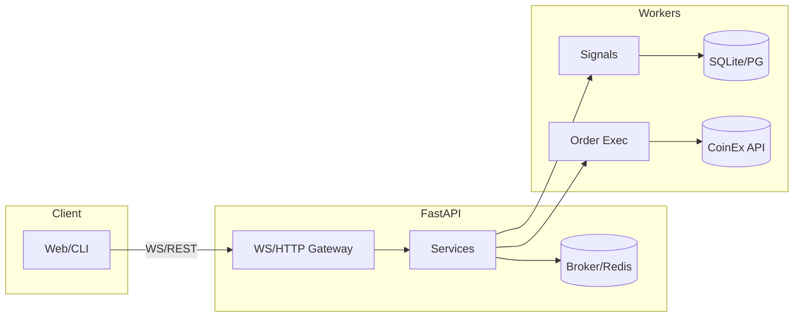

<!-- PROFILE HEADER -->

<p align="center">
  
</p>

<p align="center">
  <a href="https://github.com/amirrecon">
    
  </a>
  <a href="https://t.me/CodePhreak">
    
  </a>
  <a href="#contact">
    
  </a>
</p>

<!-- TYPING LINE -->

<p align="center">
  
</p>

---

## ⚡ About me

* Python backend dev focused on **FastAPI**, **async I/O**, and **low-latency** systems.
* Building **AI-assisted crypto trading bots** (CoinEx integrations, risk mgmt, SQLite/PG logs).
* Into **cybersecurity**: network, Linux, automation, and bug bounty practice.
* Currently leveling English → **A2 → B2**, and preparing to move abroad (CA/US).

> I like clean architecture, measurable reliability, and shipping secure-by-default code.

---

## 🧰 Tech Stack

<div align="center">

<!-- Languages -->


<br/>


<br/>


</div>

---

## 🧪 Current Projects

<table>
  <tr>
    <td width="33%" valign="top">
      <h3>Trading Bot (AI‑driven)</h3>
      <ul>
        <li>FastAPI + WebSocket gateway</li>
        <li>CoinEx integration (tickers, orders)</li>
        <li>Risk mgmt: SL/TP, position sizing</li>
        <li>SQLite/PG logs + analytics</li>
      </ul>
      <a href="#">➡ Repo (private / WIP)</a>
    </td>
    <td width="33%" valign="top">
      <h3>ShadowLink</h3>
      <ul>
        <li>Multi-hop routing (IR→DE→FR→Tor)</li>
        <li>Multi‑layer encryption & token access</li>
        <li>Failover + monitoring roadmap</li>
      </ul>
      <a href="#">Overview (design notes)</a>
    </td>
    <td width="33%" valign="top">
      <h3>GhostCLI</h3>
      <ul>
        <li>Handy automation CLI</li>
        <li>Clean DX, portable modules</li>
      </ul>
      <a href="https://github.com/amirrecon/GhostCLI">View Repo</a>
    </td>
  </tr>
</table>

---

## 🧭 Architecture taste

* **Clean boundaries**: `app/`, `core/`, `adapters/`, `domain/`, `infra/`.
* **Observability**: structured logging, trace IDs, metrics, health probes.
* **Resilience**: retries with jitter, timeouts, circuit breakers, idempotency keys.
* **Security**: least privilege, secret hygiene, dependency pinning + SCA.



---

## 🧷 Snippets I reuse a lot

<details>
  <summary><b>Production logging (uvicorn + stdlib)</b></summary>

```python
import logging
from uvicorn.config import LOGGING_CONFIG

LOGGING_CONFIG["formatters"]["default"]["fmt"] = (
    "%(asctime)s %(levelprefix)s %(name)s [%(process)d] "
    "trace=%(X-Trace-Id)s %(message)s"
)
logging.config.dictConfig(LOGGING_CONFIG)
```

</details>

<details>
  <summary><b>Resilient HTTP client (httpx + retry)</b></summary>

```python
import httpx, asyncio
from backoff import expo, on_exception

@on_exception(expo, (httpx.ReadTimeout, httpx.ConnectError), max_time=30)
async def fetch(url: str):
    async with httpx.AsyncClient(timeout=5) as client:
        r = await client.get(url)
        r.raise_for_status()
        return r.json()
```

</details>

<details>
  <summary><b>FastAPI health & version</b></summary>

```python
from fastapi import FastAPI
from importlib.metadata import version

app = FastAPI()

@app.get("/health")
async def health():
    return {"ok": True, "service": "trading-backend", "version": version("trading-backend")}
```

</details>

---

## 🐞 Bug Bounty / Security Notes

* Practicing **recon → exploit → report** flow.
* Interests: IDOR, authz bypass, SSRF, unsafe deserialization, race conditions.
* Tools I like: **Burp**, **ffuf**, **nmap**, **dirsearch**, **httpx**, **Rustscan**.

---

## 📊 GitHub Stats

<p align="center">
  
  
</p>

<p align="center">
  
</p>

---

## 🎯 Now / Goals

* ✅ Stabilize trading bot pipeline (signals → orders → logs).
* 🔒 Harden deployments (secrets, SCA, SBOM, CI checks).
* 🗣️ English practice to B2.
* 🌍 Prep for CA/US opportunities.

---

## 🤝 Work with me <a id="contact"></a>

* I build **secure, production‑ready backends** and **automation**.
* DM on Telegram **@CodePhreak**, or open an issue/discussion.

<p align="center">
  
</p>
